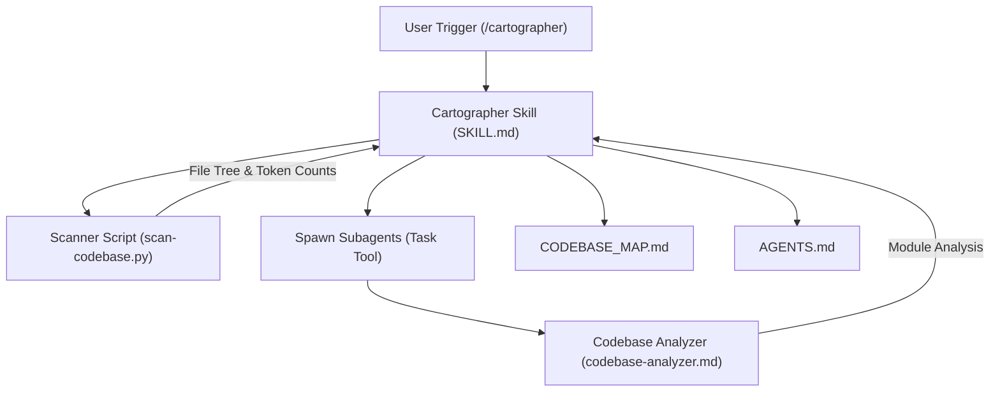

# Codebase Map: Cartographer for Cursor

This document provides a comprehensive map of the Cartographer for Cursor codebase, outlining its architecture, components, and workflows.

## System Overview

Cartographer for Cursor is a tool designed to map and document codebases of any size by orchestrating parallel subagents. It solves the context window limitation by dividing a codebase into manageable chunks, analyzing them in parallel, and synthesizing the results into a centralized map.

### Architecture Diagram

## Directory Structure

- `.cursor/`: Cursor-specific configuration and agents.
  - `agents/`: Definitions for specialized subagents.
    - `codebase-analyzer.md`: Configuration for the analysis subagent.
  - `skills/cartographer/`: The core logic of the Cartographer skill.
    - `scripts/`: Supporting scripts for the skill.
      - `scan-codebase.py`: Python script for token counting and directory scanning.
    - `SKILL.md`: Main orchestration rules and workflow for Cartographer.
- `docs/`: Generated documentation and maps.
  - `CODEBASE_MAP.md`: This file.
- `LICENSE`: Project license (MIT).
- `README.md`: General project information and setup guide.

## Module Guide

### Cartographer Orchestrator (`SKILL.md`)
- **Purpose**: The central brain of the mapping process.
- **Key Responsibilities**:
  - Validates existing maps and detects changes.
  - Runs the scanner to understand codebase size.
  - Plans work assignments for subagents.
  - Synthesizes multiple subagent reports into a final map.
- **Patterns**: Orchestration, Parallelism, Incremental Updates.

### Codebase Analyzer Agent (`.cursor/agents/codebase-analyzer.md`)
- **Purpose**: A specialized subagent focused on deep analysis of code files.
- **Capabilities**:
  - Reads and summarizes file purposes.
  - Extracts public APIs, dependencies, and patterns.
  - Identifies "gotchas" and non-obvious behaviors.
- **Constraints**: Read-only, context-limited (~100k tokens).

### Scanner Script (`.cursor/skills/cartographer/scripts/scan-codebase.py`)
- **Purpose**: A high-performance directory scanner and token counter.
- **Key Features**:
  - Respects `.gitignore`.
  - Uses `tiktoken` for accurate Claude/Gemini token estimation.
  - Handles binary detection and encoding issues.
  - Provides JSON and tree output formats.
- **Dependencies**: `tiktoken` (managed via UV).

## Data Flow

1. **Invocation**: User triggers the skill.
2. **Scanning**: `SKILL.md` invokes `scan-codebase.py` to get a JSON representation of the codebase.
3. **Planning**: `SKILL.md` calculates token budgets and groups files.
4. **Execution**: `SKILL.md` spawns `codebase-analyzer` subagents via the `Task` tool.
5. **Synthesis**: `SKILL.md` merges the subagent outputs, resolves conflicts, and identifies cross-cutting concerns.
6. **Persistence**: `SKILL.md` writes the `CODEBASE_MAP.md` and updates `AGENTS.md`.

## Conventions

- **Subagent Delegation**: The main agent MUST NOT read codebase files directly; it always delegates to subagents to prevent context overflow.
- **Markdown Documentation**: All output is formatted as structured markdown with clear headers.
- **YAML Frontmatter**: Used for metadata in agents and generated maps.
- **Parallelism**: Subagents are always spawned in a single batch message to maximize speed.

## Gotchas

- **Tool Support**: Requires Cursor Nightly and the `Task` tool (beta) to be enabled.
- **Python Runtime**: The scanner script requires Python 3.9+ (README suggests 3.11+ for better performance).
- **Token Estimation**: If `tiktoken` is unavailable, the scanner falls back to character-based estimation, which is less accurate.
- **Gitignore Limitation**: The scanner script does not support negation patterns (`!`) in `.gitignore`.

## Navigation Guide

- **How do I add a new subagent?** Define it in `.cursor/agents/` and reference it in `SKILL.md`.
- **How do I change the token budget?** Modify the grouping logic in `SKILL.md` (default is ~100k tokens per subagent).
- **How do I troubleshoot scanner errors?** Check the Python environment; `uv run` is the most reliable method.
