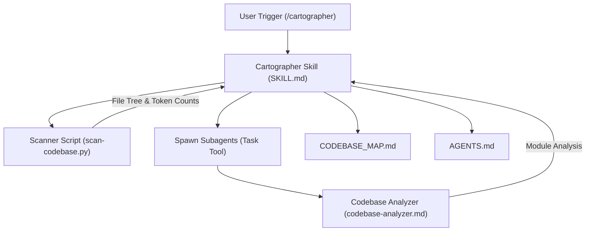
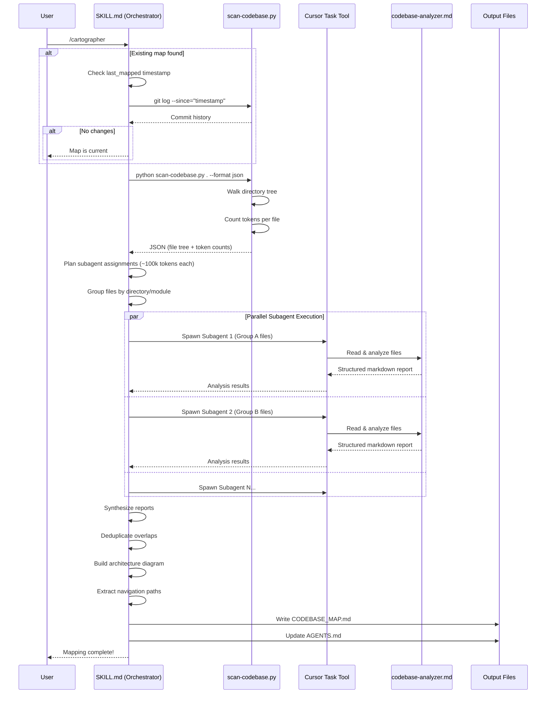

# Codebase Map: Cartographer for Cursor

> Auto-generated by Cartographer. Last mapped: January 19, 2026

This document provides a comprehensive map of the Cartographer for Cursor codebase, outlining its architecture, components, and workflows.

## System Overview

Cartographer for Cursor is a tool designed to map and document codebases of any size by orchestrating parallel AI subagents. It solves the context window limitation by dividing a codebase into manageable chunks (~100k tokens each), analyzing them in parallel via Cursor's Task tool, and synthesizing the results into a centralized map. The architecture separates concerns: a Python scanner measures the codebase, a Markdown orchestrator plans and coordinates work, and specialized subagents perform the analysis.

### Architecture Diagram



## Directory Structure

```
cartographer-cursor/
├── .cursor/                        # Cursor IDE configuration
│   ├── agents/
│   │   └── codebase-analyzer.md   # Subagent definition for file analysis
│   └── skills/cartographer/
│       ├── scripts/
│       │   └── scan-codebase.py   # Token counter & directory scanner
│       └── SKILL.md               # Main orchestration workflow
├── docs/
│   └── CODEBASE_MAP.md           # Generated architecture map (this file)
├── AGENTS.md                      # Quick reference to available agents
├── LICENSE                        # MIT License
└── README.md                      # Installation & usage guide
```

## Module Guide

### Cartographer Orchestrator (`.cursor/skills/cartographer/SKILL.md`)

**Purpose**: The central brain of the mapping process that coordinates all operations.

**Entry point**: Triggered by `/cartographer` command or natural language.

**Key files**:
| File | Purpose | Tokens |
|------|---------|--------|
| SKILL.md | Orchestration workflow & instructions | 2,174 |

**Key Responsibilities**:
- Validates existing maps and detects changes (git-based or file comparison)
- Runs the scanner to understand codebase size and structure
- Plans work assignments for subagents (~100k tokens per subagent)
- Spawns parallel subagents via Cursor Task tool
- Synthesizes multiple subagent reports into a final map
- Updates `CODEBASE_MAP.md` and `AGENTS.md`

**Patterns**: 
- Orchestration pattern (main agent coordinates, never reads codebase directly)
- Parallel subagent spawning (single batch message)
- Incremental update detection
- Token budget management
- Directory-based grouping strategy

**Dependencies**: 
- Requires `scan-codebase.py` script
- Uses `codebase-analyzer.md` subagent
- Cursor Task tool API

**Gotchas**:
- **CRITICAL**: Main agent must NEVER read codebase files directly; always delegate to subagents
- Requires Cursor Nightly with Task tool enabled
- Even small codebases (<50k tokens) use subagents (orchestration principle)
- Token budgets: `explore` subagents (100k), `generalPurpose` subagents (80k)

---

### Codebase Analyzer Agent (`.cursor/agents/codebase-analyzer.md`)

**Purpose**: A specialized read-only subagent for deep analysis of assigned files.

**Entry point**: Spawned by orchestrator via Task tool with `subagent_type: "explore"`.

**Key files**:
| File | Purpose | Tokens |
|------|---------|--------|
| codebase-analyzer.md | Subagent configuration & instructions | 344 |

**Exports**: 
- Subagent configuration (YAML frontmatter)
- Analysis instructions and output format template
- Structured markdown reports

**Capabilities**:
- Reads and summarizes file purposes
- Extracts public APIs, functions, classes, types
- Documents dependencies (imports) and dependents (usage)
- Identifies design patterns and conventions
- Flags non-obvious behaviors and gotchas

**Patterns**:
- YAML frontmatter for agent metadata (`model: fast`, `readonly: true`)
- Standardized markdown output template
- Read-only analysis (no file modifications)

**Constraints**: 
- Read-only mode only
- Context-limited to ~100k tokens per assignment
- Uses `model: fast` for efficiency

---

### Scanner Script (`.cursor/skills/cartographer/scripts/scan-codebase.py`)

**Purpose**: High-performance directory scanner with accurate token counting.

**Entry point**: CLI command `python scan-codebase.py <path> [options]`.

**Key files**:
| File | Purpose | Tokens |
|------|---------|--------|
| scan-codebase.py | Directory scanner & token counter | 3,357 |

**Key Functions**:
- `parse_gitignore(root)` - Parses `.gitignore` patterns
- `matches_pattern(path, pattern, root)` - Gitignore pattern matching
- `should_ignore(path, root, patterns)` - Determines if path should be skipped
- `count_tokens(text, encoding)` - Token counting with fallback
- `is_text_file(path)` - Binary detection via extension and content analysis
- `scan_directory(root, encoding, max_tokens)` - Main scanning function
- `format_tree(result)` - Tree visualization output
- `main()` - CLI entry point

**Key Features**:
- Respects `.gitignore` patterns (except negation `!`)
- Uses `tiktoken` with `cl100k_base` encoding (Claude-compatible)
- Handles binary detection and encoding issues gracefully
- Provides JSON and tree output formats
- Enforces token budget (default 50k tokens per file, 1MB max size)
- Comprehensive default ignore patterns (node_modules, .git, build artifacts, etc.)

**Dependencies**: 
- `tiktoken` (auto-installed via UV inline script dependencies, PEP 723)
- Python 3.9+ (3.11+ recommended)

**Patterns**:
- UV inline script dependencies for automatic package management
- Recursive directory walking with permission error handling
- Multiple output formats (JSON, tree, compact)
- Fallback to character-based estimation if tiktoken fails

**Gotchas**:
- Does NOT support negation patterns (`!`) in `.gitignore`
- Skips files >1MB or >50k tokens (configurable via `--max-tokens`)
- Uses `errors="ignore"` for encoding issues
- Permission errors are logged but don't stop scanning

---

### Documentation Files

**AGENTS.md** (172 tokens)
- **Purpose**: Quick reference listing available agents/skills
- **Structure**: Simple markdown with summaries and links
- **Updated by**: Cartographer skill after each mapping

**README.md** (1,156 tokens)
- **Purpose**: User-facing installation and usage guide
- **Key sections**: Installation (Quick & Global), Prerequisites, Usage, Comparison table
- **Prerequisites**: Cursor Nightly, Python 3.11+, UV (recommended)
- **Installation**: Copy `.cursor` folder, restart Cursor

**LICENSE** (236 tokens)
- **Type**: MIT License (permissive, allows commercial use)
- **Copyright**: Dual copyright - Original (Bootoshi 2025), Fork (MPGek 2026)
- **Terms**: Requires copyright notice in copies

**CODEBASE_MAP.md** (1,086 tokens)
- **Purpose**: This file - generated architecture documentation
- **Structure**: YAML frontmatter + structured markdown + Mermaid diagrams
- **Metadata**: `last_mapped`, `total_files`, `total_tokens`
- **Auto-generated**: Should not be manually edited

## Data Flow

### Main Workflow Sequence



### Key Data Transformations

1. **Directory Tree → JSON**: Scanner converts filesystem structure to JSON with token counts
2. **JSON → Subagent Assignments**: Orchestrator groups files by token budget (~100k each)
3. **File Contents → Analysis**: Subagents read files and extract structure/purpose/patterns
4. **Multiple Reports → Unified Map**: Orchestrator synthesizes all reports into single document
5. **Map → Summary**: Key points extracted to `AGENTS.md` for quick reference

## Conventions

### Architectural Principles

- **Orchestration over Direct Execution**: The main agent coordinates; subagents execute. This is the core design principle.
- **Subagent Delegation**: The main agent MUST NEVER read codebase files directly; it always delegates to subagents to prevent context overflow.
- **Parallelism First**: All subagents are spawned in a single batch message to maximize speed and efficiency.
- **Token Budget Management**: Strict ~100k token limit per subagent prevents context overflow.
- **Directory-Based Grouping**: Files are grouped by directory/module to keep related code together.
- **Read-Only Analysis**: Subagents never modify files; they only analyze and report.

### Code & Documentation Standards

- **Markdown Documentation**: All output is structured markdown with clear headers and tables.
- **YAML Frontmatter**: Used for metadata in agents, skills, and generated maps.
- **Mermaid Diagrams**: Architecture and sequence diagrams use Mermaid syntax.
- **UV Package Management**: Preferred over pip for Python dependencies (inline script dependencies via PEP 723).
- **Incremental Updates**: Update mode preserves unchanged sections and only re-analyzes modified modules.

### Naming Conventions

- **Agent Files**: `<agent-name>.md` in `.cursor/agents/`
- **Skill Files**: `SKILL.md` in `.cursor/skills/<skill-name>/`
- **Generated Maps**: `CODEBASE_MAP.md` in `docs/`
- **Scanner Script**: `scan-codebase.py` with CLI interface

## Gotchas

### Environment Requirements

- **Cursor Nightly Required**: This tool requires Cursor Nightly with beta Task tool enabled
- **Python Version**: Requires Python 3.9+ (3.11+ strongly recommended for better performance)
- **UV Recommended**: While not required, UV is the recommended package manager for reliability

### Scanner Limitations

- **No Negation Patterns**: The scanner does NOT support negation patterns (`!`) in `.gitignore`
- **File Size Limits**: Skips files >1MB or >50k tokens (configurable via `--max-tokens` flag)
- **Token Estimation Fallback**: If `tiktoken` is unavailable, falls back to character-based estimation (less accurate)
- **Permission Handling**: Permission errors are logged but don't stop scanning (may miss some files)
- **Encoding Issues**: Uses `errors="ignore"` to handle encoding problems (may miss some content)

### Orchestration Critical Rules

- **NEVER Direct File Reading**: Main agent must NEVER read codebase files directly - always use subagents
- **Even Small Codebases**: Even codebases <50k tokens must use subagents (orchestration principle)
- **Single Batch Spawning**: All subagents must be spawned in ONE message with multiple Task tool calls
- **Token Budget Differences**: Different subagent types have different budgets (explore: 100k, generalPurpose: 80k)

### Installation & Setup

- **Restart Required**: After copying `.cursor` folder, Cursor must be restarted
- **Tiktoken Auto-Install**: When using `uv run`, tiktoken is auto-installed in isolated environment
- **Scanner Execution Order**: Try `uv run` → venv → system python → python3 in that order

## Navigation Guide

### Getting Started

**To install Cartographer:**
1. Copy the `.cursor` folder to your project root
2. Restart Cursor
3. Ensure Python 3.9+ is installed (3.11+ recommended)
4. Install UV: `pip install uv` (optional but recommended)

**To run Cartographer:**
- Type `/cartographer` in Cursor chat
- Or use natural language: "map this codebase", "document the architecture"

### Common Tasks

**To update an existing map:**
- Just run `/cartographer` again - it auto-detects changes and updates only modified sections

**To troubleshoot scanner errors:**
1. Try `uv run .cursor/skills/cartographer/scripts/scan-codebase.py . --format json`
2. If that fails, try `.venv/Scripts/python` (Windows) or `.venv/bin/python` (Unix)
3. If tiktoken is missing: `uv pip install tiktoken` or `pip install tiktoken`
4. Check Python version: `python --version` (must be 3.9+)

**To add a new subagent:**
1. Create `<agent-name>.md` in `.cursor/agents/`
2. Add YAML frontmatter with `name`, `description`, `model`, `readonly`
3. Reference it in `SKILL.md` workflow

**To change token budget per subagent:**
- Edit the "Token budget per subagent" value in `.cursor/skills/cartographer/SKILL.md` (default: ~100k)
- Also update the Token Budget Reference table

**To customize scanner behavior:**
- Use `--max-tokens` flag to change file size limit (default: 50,000)
- Use `--encoding` flag to change tokenizer (default: cl100k_base)
- Use `--format` for output format: `json`, `tree`, or `compact`

**To modify ignore patterns:**
- Scanner respects `.gitignore` automatically
- Add patterns to `DEFAULT_IGNORE` set in `scan-codebase.py` for global ignores

### File Locations Quick Reference

| What | Where |
|------|-------|
| Main orchestration logic | `.cursor/skills/cartographer/SKILL.md` |
| Subagent definition | `.cursor/agents/codebase-analyzer.md` |
| Scanner script | `.cursor/skills/cartographer/scripts/scan-codebase.py` |
| Generated map | `docs/CODEBASE_MAP.md` |
| Agent summary | `AGENTS.md` |
| Installation guide | `README.md` |

### Understanding the Output

**CODEBASE_MAP.md sections:**
- **System Overview**: High-level architecture and purpose
- **Directory Structure**: File tree with annotations
- **Module Guide**: Detailed file/module documentation
- **Data Flow**: Sequence diagrams showing workflows
- **Conventions**: Design principles and patterns
- **Gotchas**: Important warnings and limitations
- **Navigation Guide**: This section - practical how-tos

### Troubleshooting

**"Task tool not found"**
- Ensure you're using Cursor Nightly
- Enable beta features in Cursor settings

**"tiktoken not found"**
- Run: `uv run` (auto-installs) or `uv pip install tiktoken`

**"Permission denied" errors**
- Scanner logs these but continues - this is normal for restricted directories

**Map shows outdated information**
- Check `last_mapped` timestamp in CODEBASE_MAP.md frontmatter
- Run `/cartographer` again to update
