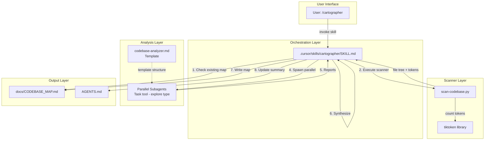
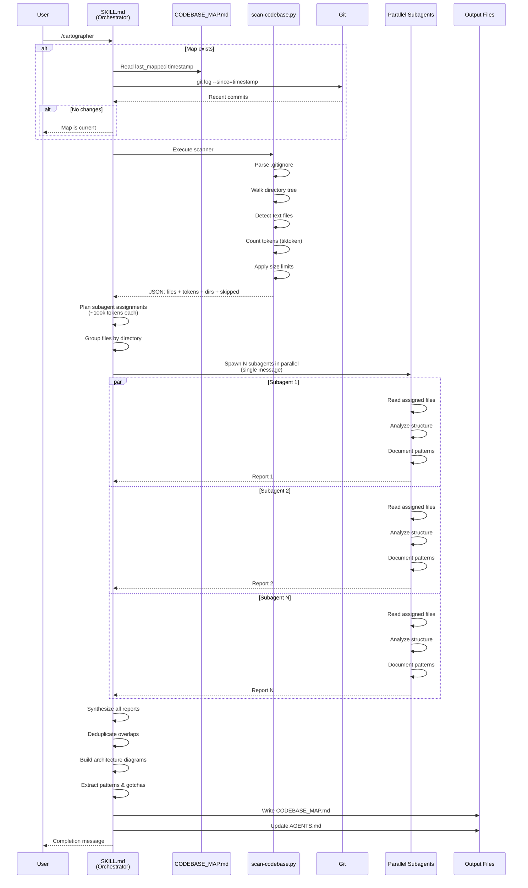
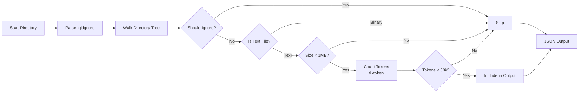

# Codebase Map

> Auto-generated by Cartographer. Last mapped: 2026-01-19

## System Overview

Cartographer is a codebase mapping tool for Cursor IDE that orchestrates parallel AI subagents to analyze and document codebases of any size. This is a port of the original Claude Code plugin, adapted specifically for Cursor's Task tool API.

**Core Concept**: The main orchestrator delegates file reading to subagents, which analyze assigned files and return structured reports that are synthesized into comprehensive documentation.



## Directory Structure

```
cartographer/
├── .cursor/                     # Cursor IDE implementation
│   ├── agents/
│   │   └── codebase-analyzer.md # Subagent template (344 tokens)
│   └── skills/
│       └── cartographer/
│           ├── SKILL.md         # Main orchestration logic (1,789 tokens)
│           └── scripts/
│               └── scan-codebase.py  # Token counter (3,357 tokens)
├── docs/
│   └── CODEBASE_MAP.md          # Generated documentation (2,382 tokens)
├── .python-version              # Python 3.11 requirement (4 tokens)
├── CURSOR.md                    # Project overview (587 tokens)
├── LICENSE                      # MIT License (236 tokens)
├── README.md                    # User documentation (1,054 tokens)
└── requirements.txt             # Dependencies (10 tokens)
```

## Module Guide

### Orchestration Module

**Purpose**: Coordinates the entire mapping workflow using parallel subagents  
**Entry point**: `.cursor/skills/cartographer/SKILL.md`

**Key files**:
| File | Purpose | Tokens |
|------|---------|--------|
| `.cursor/skills/cartographer/SKILL.md` | Main workflow orchestration | 1,789 |

**Exports**:
- `/cartographer` skill command
- Workflow orchestration logic:
  1. Check for existing map
  2. Run scanner for token counts
  3. Plan subagent assignments (~100k tokens each)
  4. Spawn parallel subagents
  5. Synthesize reports
  6. Write documentation
- Update detection and incremental mapping

**Dependencies**:
- `scan-codebase.py` (scanner script)
- `codebase-analyzer.md` (subagent template)
- Cursor's Task tool API
- Python 3.11+
- tiktoken library

**Patterns**:
- **Orchestrator pattern**: Main agent plans and delegates, never reads codebase files directly
- **Parallel execution**: All subagents spawned in a single message for true concurrency
- **Token-based work splitting**: Groups files by directory/module, balances token counts
- **Incremental updates**: Detects existing map via `last_mapped` timestamp, only re-analyzes changed modules

**Gotchas**:
- **CRITICAL**: Main agent must NOT read codebase files directly; always delegate to subagents
- Requires Cursor Nightly release channel (beta feature)
- All subagents must be spawned in a SINGLE message for parallelism
- Uses `subagent_type: "explore"` with `model: "fast"` for efficiency
- Scanner execution has fallback order: UV → venv → system Python

### Scanner Module

**Purpose**: Scans directory tree, respects `.gitignore`, outputs file paths with token counts  
**Entry point**: `.cursor/skills/cartographer/scripts/scan-codebase.py`

**Key files**:
| File | Purpose | Tokens |
|------|---------|--------|
| `.cursor/skills/cartographer/scripts/scan-codebase.py` | Token counting scanner | 3,357 |

**Exports**:
- `scan_directory()` - Main scanning function
- `parse_gitignore()` - Parses `.gitignore` patterns
- `should_ignore()` - Ignore pattern matching
- `count_tokens()` - Token counting via tiktoken
- `is_text_file()` - Text vs binary detection
- `format_tree()` - Tree structure formatting
- CLI with JSON/tree/compact output formats

**Imports**:
- Standard library: `argparse`, `json`, `sys`, `pathlib`, `fnmatch`
- External: `tiktoken` (required)

**Patterns**:
- **UV inline dependencies**: Uses PEP 723 `# /// script` format for automatic dependency installation
- **Gitignore-style matching**: Supports `/`, `*`, directory-only patterns (simplified implementation)
- **Binary detection**: Heuristic using null byte check + UTF-8 decode attempt
- **Token counting**: Uses `cl100k_base` encoding (Claude-compatible)
- **Size limits**: Skips files >1MB or >50k tokens (configurable)
- **Multiple output formats**: JSON (structured), tree (visual), compact (sorted by tokens)

**Gotchas**:
- Requires `tiktoken` - auto-installed with `uv run`, otherwise manual install needed
- Binary detection is heuristic-based, not perfect
- Large files silently skipped without warning in output
- Path separators use OS-native format (backslashes on Windows)
- Gitignore negation (`!`) not supported
- Permission errors result in skipped directories (logged in skipped list)
- Text file detection uses extension whitelist + binary heuristics (may miss edge cases)

### Subagent Template Module

**Purpose**: Defines structure and format for codebase analysis subagents  
**Entry point**: `.cursor/agents/codebase-analyzer.md`

**Key files**:
| File | Purpose | Tokens |
|------|---------|--------|
| `.cursor/agents/codebase-analyzer.md` | Analysis template | 344 |

**Exports**:
- Subagent definition with YAML frontmatter:
  - `name: codebase-analyzer`
  - `model: fast`
  - `readonly: true`
- Structured analysis format:
  - Purpose
  - Exports
  - Imports
  - Patterns
  - Gotchas

**Dependencies**: None (markdown definition file)

**Patterns**:
- YAML frontmatter for subagent metadata
- Read-only subagent pattern
- Fast model for cost efficiency
- Consistent markdown output structure

**Gotchas**:
- Read-only: explicitly states "do NOT make changes to files"
- Used as template/reference; actual subagents spawned dynamically via Task tool
- Analysis format must match specified structure for synthesis

### Documentation Module

**Purpose**: Generated and manual documentation files  
**Entry points**: `docs/CODEBASE_MAP.md`, `README.md`, `CURSOR.md`

**Key files**:
| File | Purpose | Tokens |
|------|---------|--------|
| `docs/CODEBASE_MAP.md` | Generated comprehensive map | 2,382 |
| `README.md` | User-facing documentation | 1,054 |
| `CURSOR.md` | Project overview | 587 |

**Exports**:
- **CODEBASE_MAP.md**:
  - YAML frontmatter with `last_mapped`, `total_files`, `total_tokens`
  - System overview with Mermaid diagrams
  - Directory structure
  - Module guide
  - Data flow diagrams
  - Conventions and patterns
  - Gotchas and warnings
  - Navigation guide
- **README.md**:
  - Installation instructions
  - Prerequisites
  - Usage examples
  - Feature comparison
- **CURSOR.md**:
  - Codebase overview
  - Stack information
  - Quick start guide

**Patterns**:
- Mermaid diagrams for visual architecture
- YAML frontmatter for metadata tracking
- Structured sections with consistent headers

**Gotchas**:
- CODEBASE_MAP.md is auto-generated - manual edits will be overwritten
- Mermaid diagrams require compatible renderer

### Configuration Module

**Purpose**: Define project dependencies and requirements  
**Entry points**: `.python-version`, `requirements.txt`, `LICENSE`

**Key files**:
| File | Purpose | Tokens |
|------|---------|--------|
| `.python-version` | Python version spec | 4 |
| `requirements.txt` | Dependency list | 10 |
| `LICENSE` | MIT License | 236 |

**Exports**:
- Python version: `3.11`
- Dependencies: `tiktoken>=0.5.0`
- License: MIT (dual copyright: Bootoshi 2025, MPGek 2026)

**Dependencies**: None

**Dependents**:
- All Python scripts depend on `.python-version` and `requirements.txt`

**Gotchas**:
- UV and pyenv read `.python-version` for version selection
- No patch version specified in `.python-version` (3.11.x acceptable)
- Minimal dependencies (only tiktoken) for easy installation

## Data Flow

### Complete Mapping Workflow



### Scanner Internal Flow



## Conventions

### File Organization

- All Cursor implementation files in `.cursor/` directory
- Skills in `.cursor/skills/<skill-name>/`
- Subagents in `.cursor/agents/`
- Scripts in `.cursor/skills/<skill-name>/scripts/`
- Generated docs in `docs/`

### Naming Patterns

- Skills: lowercase with hyphens (e.g., `cartographer`)
- Subagents: lowercase with hyphens (e.g., `codebase-analyzer`)
- Scripts: lowercase with hyphens (e.g., `scan-codebase.py`)
- YAML frontmatter in all definition files

### Code Patterns

- **UV inline dependencies**: Scripts use PEP 723 `# /// script` format
- **Parallel execution**: All subagents spawned in single message
- **Structured output**: Markdown with consistent headers
- **Read-only analysis**: Subagents use `readonly: true`
- **Token awareness**: Work split based on token budgets (~100k per subagent)

### Token Budgets

| Model | Budget per Subagent | Notes |
|-------|---------------------|-------|
| fast | ~100,000 tokens | Default model for subagents |

### Design Principles

1. **Separation of concerns**: Scanner (tokens) vs Analyzer (understanding) vs Orchestrator (coordination)
2. **Parallelism**: Multiple subagents work concurrently
3. **Token awareness**: Work split by token counts, not just file count
4. **Incremental updates**: Only re-analyze changed modules
5. **Read-only analysis**: Subagents never modify codebase

## Gotchas

### Scanner Script

- **UV required**: Running with `uv run` auto-installs tiktoken; otherwise must be pre-installed
- **Binary detection**: Heuristic-based (null bytes + UTF-8 decode) - not perfect
- **Path separators**: Output uses OS-native separators (backslashes on Windows)
- **Large files**: Files >1MB or >50k tokens silently skipped without warning
- **Gitignore limitations**: Negation (`!`) not supported, simplified pattern matching
- **Permission errors**: Inaccessible directories logged as skipped
- **Text detection**: Extension whitelist + heuristics may miss edge cases

### Skill Execution

- **Nightly required**: Must be on Cursor Nightly release channel
- **Orchestration pattern**: Main agent MUST NOT read codebase files directly
- **Single message spawn**: All subagents must be spawned in one message for parallelism
- **Model selection**: Uses `fast` model for cost efficiency
- **Update detection**: Uses git history or file comparison if git unavailable
- **Cursor restart**: May be needed after skill installation for it to load

### Environment

- **Python version**: Must be 3.11+ (specified in `.python-version`)
- **Git optional**: Change detection works without git but is more accurate with it
- **Write permissions**: Needs write access to `docs/` directory and summary file
- **Tiktoken dependency**: Required for scanner, auto-installed via UV or needs manual install

## Navigation Guide

### To use Cartographer

1. **Enable Cursor Nightly**: Settings → Beta → Nightly release channel
2. **Install Python 3.11+**: Download from python.org or use pyenv
3. **Create venv**: `uv venv` (or `python -m venv .venv`)
4. **Install dependencies**: `uv pip install -r requirements.txt`
5. **Restart Cursor**: May be needed for skill to load
6. **Invoke**: Type `/cartographer` or say "map this codebase"

### To run scanner manually

Choose method based on your setup:

```bash
# Option 1: UV run (preferred - auto-installs tiktoken)
uv run .cursor/skills/cartographer/scripts/scan-codebase.py . --format json

# Option 2: Using project venv
.venv/Scripts/python .cursor/skills/cartographer/scripts/scan-codebase.py . --format json

# Option 3: System Python (requires tiktoken installed)
python .cursor/skills/cartographer/scripts/scan-codebase.py . --format json
```

### To modify the skill workflow

Edit `.cursor/skills/cartographer/SKILL.md` to change:
- Orchestration logic
- Token budgets per subagent
- Output format and structure
- Update detection logic

### To create a custom subagent

1. Create `.cursor/agents/your-subagent.md`
2. Add YAML frontmatter:
   ```yaml
   name: your-subagent
   description: What it does
   model: fast
   readonly: true
   ```
3. Write prompt instructions
4. Reference in skill or invoke directly with Task tool

### To update an existing map

- Simply run `/cartographer` again
- Skill automatically detects existing map via `last_mapped` timestamp
- Enters update mode: only re-analyzes changed modules
- Preserves unchanged sections

### To understand the architecture

- Read this file (`docs/CODEBASE_MAP.md`) for comprehensive overview
- Check Mermaid diagrams for visual architecture and data flow
- Review Module Guide for detailed file-by-file documentation

## Key Technologies

**Languages**: Python 3.11, Markdown  
**Dependencies**: tiktoken (token counting)  
**Tooling**: UV (package manager), Git (change detection)  
**Platform**: Cursor IDE (Nightly release)  
**Output Formats**: JSON, Markdown, Mermaid diagrams  
**AI Integration**: Cursor's Task tool API with explore-type subagents
